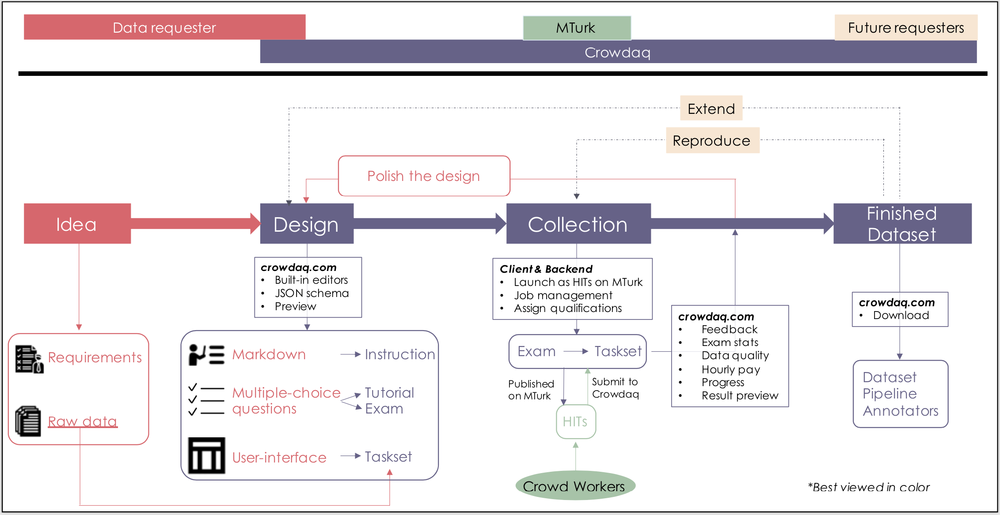
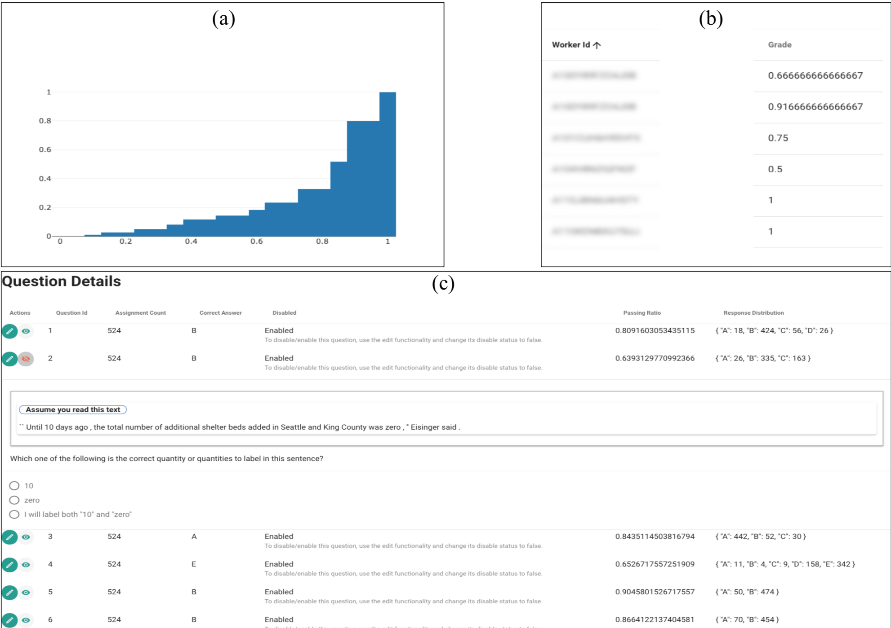
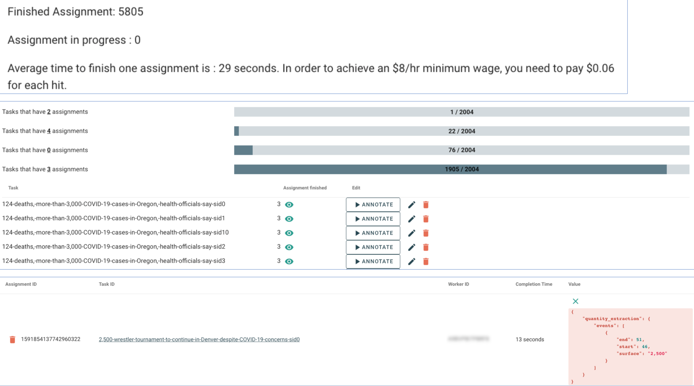

Get Started
------------
## EMNLP Reviewers

This work is currently in submission to EMNLP'2020 (demo track). If you are a reviewer for this submission, please check [here](../emnlp-reviewers) for additional information intended for you.

## Account

### Sign-up 
As of now, we are only taking sign-up requests through emails. If you don't already have an account to login, please send an email to Qiang Ning at \[first name\]\[last initial\]@allenai.org.

### Login
If you have your login credentials, you can go to https://www.crowdaq.com and look for the login portal.

## Data Collection Workflow

| Components  | Description | Name on Crowdaq | Specification| Note |
|:------------|:------------|:----------------------:|:-------------:|:-------------|
| Task definition	|  It defines a task and instructs annotators how to complete the tasks. | Instruction | Markdown | It supports various formatting options, including images and videos. Any static annotation guidelines can be displayed here. |
| Examples			| Additional training material that workers can use to gauge their understanding of the instruction. | Tutorial | JSON | As of now tutorials are in the form of multiple-choice questions. Anyone, either through or without MTurk, can work on tutorials and see the answers and doesn't get penalized. |
| Qualification		| It tests annotators' understanding of the task and only those qualified can continue; this step is very important in reducing unqualified annotators. | Exam | JSON | Another collection of multiple-choice questions. Participants will only have a finite number of opportunities to work on it, and each time they will see a random subset from a larger pool. After finishing an exam, participants are informed of how many mistakes they have made and whether they have passed, but they do not receive feedback on individual questions. |
| Main annotations	| Where qualified annotators work on the task | Task set | JSON | We provide many built-in UI components that you can use to build very complex annotation interfaces. More details in the [syntax](syntax.md) section.

As a requester, the general workflow for collecting data via Crowdaq and MTurk is shown below (we have color-coded the figure above to show the responsibilities of the data requester, Crowdaq, MTurk, and future requesters who want to reproduce or extend this dataset):
- Identify the requirements of an application and find the raw data that one wants to annotate.
- Design the data collection pipeline using the built-in editors on Crowdaq's website, including the instruction, tutorial, exam, and task set/interface.
- Launch the exam and task set onto MTurk and get crowd annotators to work on them.
- If the quality and size of the data have reached one's requirement, publish the dataset. 


### Design
The following files are already put into the account for EMNLP reviewers, who don't have to perform "How to add it to your Crowdaq account" anymore.

| Component | Resource file | How to add it to your Crowdaq account | Visualization |
|:----------|:----------|:---------|:--------------|
|Instruction|[markdown file](./examples/example_instruction.md)|Go to `Instructions` on Crowdaq, click `+ADD`, paste the file content and click `SAVE`.|[preview](https://beta.crowdaq.com/w/instruction/emnlp20/example_instruction)|
|Tutorial|[Tutorial json](./examples/example_tutorial.json)|Go to `Tutorial` on Crowdaq, click `+ADD`, paste the file content and click `SAVE`.|[preview](https://beta.crowdaq.com/w/tutorial/emnlp20/example_tutorial)|
|Exam (step 1)|[Exam question set](./examples/example_questionset.json)|Go to `Question Set` on Crowdaq, click `+ADD`, type `example_questionset` in the ID field, upload this JSON file from your computer, and click `CREATE`.|We currently don't allow public preview of this question set because it's used in exams and should be kept confidential.|
|Exam (step 2)| None | Go to `Exams` on Crowdaq, click `+ADD`, and you'll see an interface which allows you to specify how you want this exam. See [this](./figs/create-exam-screenshot.png) for an example configuration. The fields should be rather self-explanatory.|[preview](https://beta.crowdaq.com/w/exam/emnlp20/example_exam)|
|Task|[Task json](./examples/example_taskitem.json)|Go to `TaskSet List` on Crowdaq, click `+ADD`, type `example_taskset` in the ID field, and then within this taskset, click `+ADD TASK`, type `example_taskitem` in the ID field, paste the file content and click `SAVE`.|[preview](https://beta.crowdaq.com/w/task/emnlp20/example_taskset/example_taskitem)|

Note you can always preview your files in your own account on Crowdaq. The preview links above are separate files that we have created and you can double check if you have done it correctly.

### Collection
It is very easy to launch an exam to MTurk. Crowdaq comes with a [client](https://github.com/qiangning/crowdaq-client) package that one can run from a local computer. The backend of Crowdaq will do the job management, assign qualifications, and provide some handy analysis of how well participants are doing on the exam, including the score distribution of participants and analysis on each individual questions (see below for a screenshot of it).



In the client directory, one can run
```
python mturk_cli.py -p [mturk profile] launch-task [exam-config.json] -u [URL to your exam]
```
to launch it. Specifically, `mturk_profile` can be found in your `~/.aws/credentials` file; `exam-config.json` is a configuration file that looks like the following (the fields should be self-explanatory):
```
{
	"mturk_config": {
		"sandbox": false,
		"reward_per_hit": 0.01,
		"num_of_hits": 300,
		"lifetime_min": "60*24*30",
		"session_duration_min": "60",
		"auto_approval_min": "60*24*1",
		"require_master": false,
		"require_US": false,
		"other_qualifications":[]
	},
	"meta":{
		"title": "",
		"description": "",
		"keywords": ""
	}
}
```
and `URL to your exam` is just the URL that you use to preview your exams. For instance, if you want to launch https://beta.crowdaq.com/w/exam/emnlp20/example_exam, then just use that as your `URL to your exam`.

The semantic difference between exams and task sets is handled by the backend of Crowdaq. From MTurk's perspective, exams and task sets are both ExternalQuestions---a particular type of HITs on MTurk. Therefore, the same client package can also be used to launch a task set to MTurk (see [here](./launch.md) for more details). Crowdaq's backend will receive the annotations submitted by crowd workers; the website will show the annotation progress and average time spent on each task, and also provide quick preview of each individual annotations (see below).

